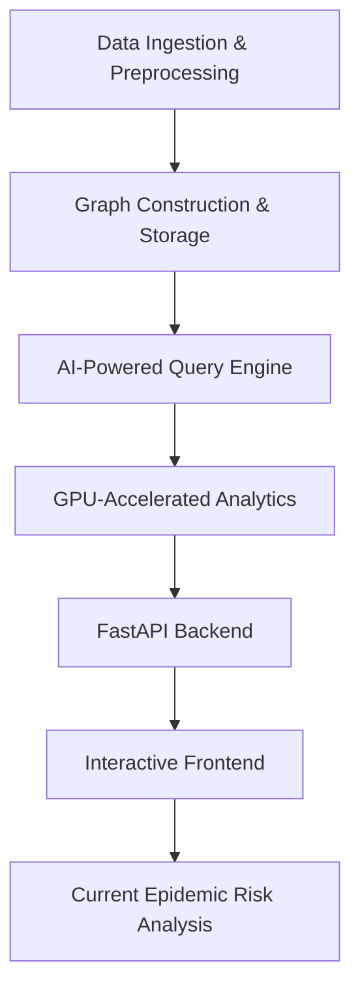

# ViralSense: AI-Powered Epidemic Risk Analysis System

## Overview
**ViralSense** is an AI-driven system that analyzes healthcare data to detect potential epidemic risk areas through graph analytics. The system processes patient records, hospital interactions, and treatment histories—transforming them into a rich graph stored in ArangoDB. By integrating LangChain with GPU-accelerated analytics, ViralSense enables natural language querying and deep analysis of the graph structure to identify outbreak clusters and potential super-spreader nodes. It does not forecast future outbreaks but rather highlights risk patterns based on current data.

---

## Features
- **Graph-Based Risk Analysis:** Converts healthcare data into a structured graph to reveal current risk patterns.
- **AI-Powered Querying:** Uses LangChain and OpenAI to translate natural language queries into optimized AQL queries.
- **GPU-Accelerated Analytics:** Leverages cuGraph and NetworkX algorithms (e.g., PageRank, community detection, betweenness centrality) to analyze the connectivity of the network and identify high-risk clusters and potential super-spreaders.
- **Dynamic Epidemic Query Processing:** The system routes epidemic-related queries to specialized analytics modules that extract communities and compute centrality metrics.
- **Interactive API & Dashboard:** Provides a FastAPI-based backend for query execution and supports frontend dashboards (using Streamlit or React) for visualization of the graph and analytics results.

---

## Tech Stack
- **Database:** ArangoDB (Graph Database)
- **Graph Processing:** NetworkX, cuGraph (GPU-Accelerated)
- **AI & LLMs:** OpenAI API, LangChain, GraphRAG
- **Backend API:** FastAPI, Uvicorn
- **Frontend:** Streamlit (or React for a modern UI)
- **Cloud & Deployment:** Google Colab, ArangoDB Cloud, ngrok (for API exposure)

---

## Project Architecture



---

## Installation Guide

### 1. Environment Setup
Ensure you have **Python 3.9+** installed. Create and activate a virtual environment:

```bash
python -m venv viralsense-env
source viralsense-env/bin/activate  # macOS/Linux
viralsense-env\Scripts\activate     # Windows
```

Install the required packages:

```bash
pip install -r requirements.txt
```

*Example `requirements.txt`:*
```
arango
arango-datasets
networkx
nx_arangodb
langchain
langchain-openai
langchain-community
cugraph-cu11
dask-cudf-cu11
cuml-cu11
fastapi
uvicorn
pyngrok
nest_asyncio
streamlit
```

---

### 2. Database & Data Preparation
- **ArangoDB Setup:**  
  Install ArangoDB, create a new database, and load the **Synthea P100** dataset.

- **Data Transformation:**  
  Transform the dataset into a NetworkX graph and persist it to ArangoDB.

*Example:*
```python
from arango.client import ArangoClient
from arango_datasets import Datasets

client = ArangoClient(hosts='https://<your-arango-url>')
db = client.db('_system', username='root', password='your_password')
datasets = Datasets(db)
datasets.load('SYNTHEA_P100')
```

---

### 3. Running the AI-Powered Query Engine
Start the **FastAPI** backend to process natural language queries:

```bash
uvicorn main:app --host 0.0.0.0 --port 8000
```

Expose your API using **ngrok** (if needed):

```bash
ngrok http 8000
```

*Example API request:*
```python
import requests

response = requests.post("http://localhost:8000/query", json={"query": "Find potential super-spreaders"})
print(response.json())
```

---

### 4. Running the Frontend Dashboard
To launch the interactive dashboard (using Streamlit as an example):

```bash
streamlit run app.py
```

---

## Core Functionalities

### AI-Powered Query Engine
Utilizes **LangChain** to process natural language queries and convert them into AQL queries:
```python
from langchain_openai import ChatOpenAI
from langchain.prompts import PromptTemplate

llm = ChatOpenAI(temperature=0, openai_api_key="YOUR_OPENAI_API_KEY")
aql_prompt_template = PromptTemplate(
    input_variables=["nl_query"],
    template="""
You are an expert in ArangoDB and AQL. Given the healthcare dataset, generate an optimized AQL query for:
"{nl_query}"
Provide only the valid AQL query as output.
"""
)
```

### GPU-Accelerated Epidemic Risk Analytics
Leverages **cuGraph** for advanced analytics such as PageRank and community detection to analyze the current state of the network:
```python
import cugraph
import cudf
import networkx as nx
import pandas as pd

def compute_pagerank(nx_graph):
    edges = [(u, v) for u, v in nx_graph.edges()]
    df = pd.DataFrame(edges, columns=["src", "dst"])
    g_df = cudf.DataFrame.from_pandas(df)
    cuG = cugraph.Graph()
    cuG.from_cudf_edgelist(g_df, source='src', destination='dst', renumber=True)
    pr_result = cugraph.pagerank(cuG)
    return pr_result
```

In epidemic-specific queries, the system:
- Executes an AQL query to extract relevant data.
- Builds a subgraph from the results.
- Detects communities using greedy modularity.
- Computes betweenness centrality to identify potential super-spreaders within each community.
- Summarizes these analytics into natural language responses.

---

## Demo & Presentation Strategy
1. **Live Query Execution:**  
   Demonstrate real-time processing of natural language queries that yield dynamic AQL queries and risk analytics.
2. **Graph Visualization:**  
   Showcase interactive visualizations of detected clusters and potential super-spreader nodes.
3. **Real-World Impact:**  
   Explain how ViralSense provides insight into current epidemic risk patterns, enabling healthcare professionals to focus on high-risk areas.

---

## Next Steps & Improvements
- **Graph Neural Networks (GNNs):** Explore GNNs (using PyTorch Geometric) for advanced analysis and future risk modeling.
- **Enhanced UI:** Upgrade the frontend using React for a more modern, interactive experience.
- **Cloud Deployment:** Deploy the application on AWS or GCP for enhanced scalability.
- **Advanced Query Routing:** Further refine the AI agent to better determine when to use standard AQL queries versus GPU-accelerated analytics.

---

## Contributors
- **Harmandeep Singh** ([@Harman717](https://github.com/Harman717))
- **Simardeep Singh** ([@Simar710](https://github.com/Simar710))

---
